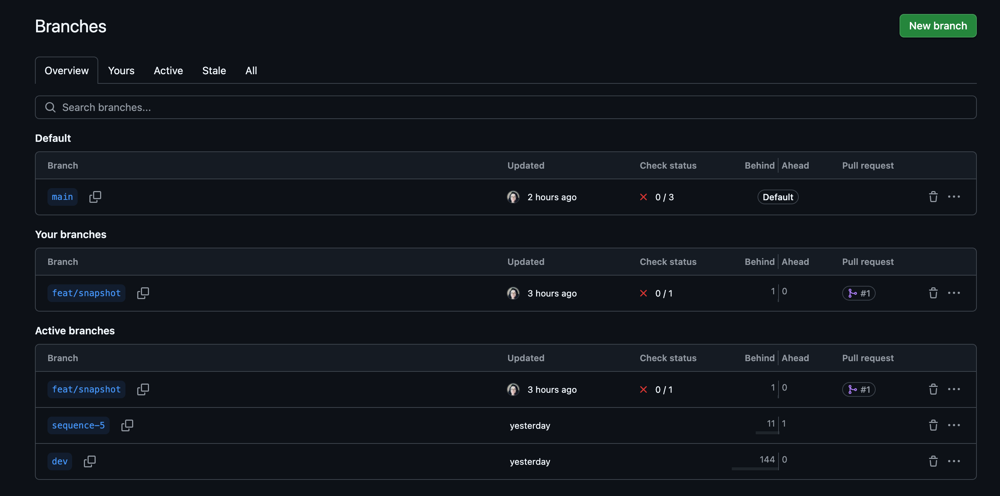
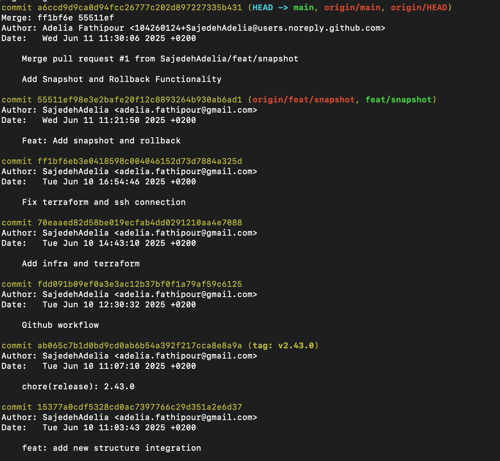
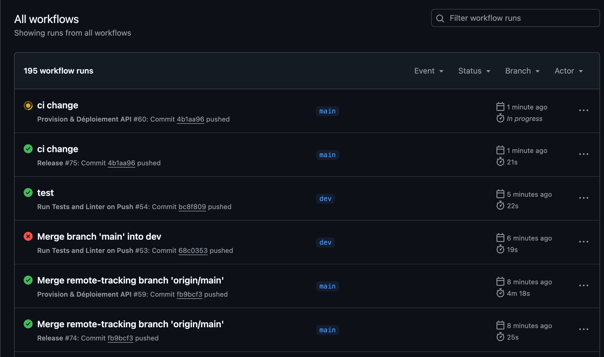
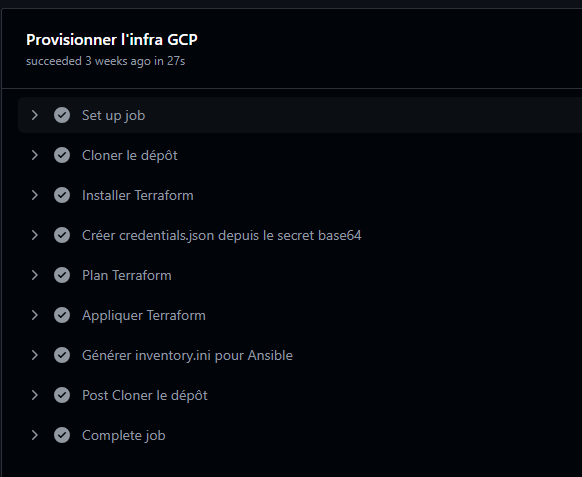
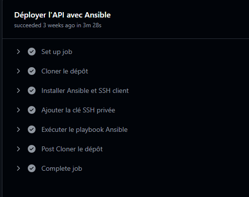
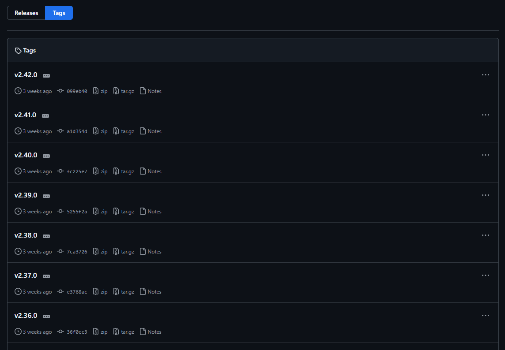
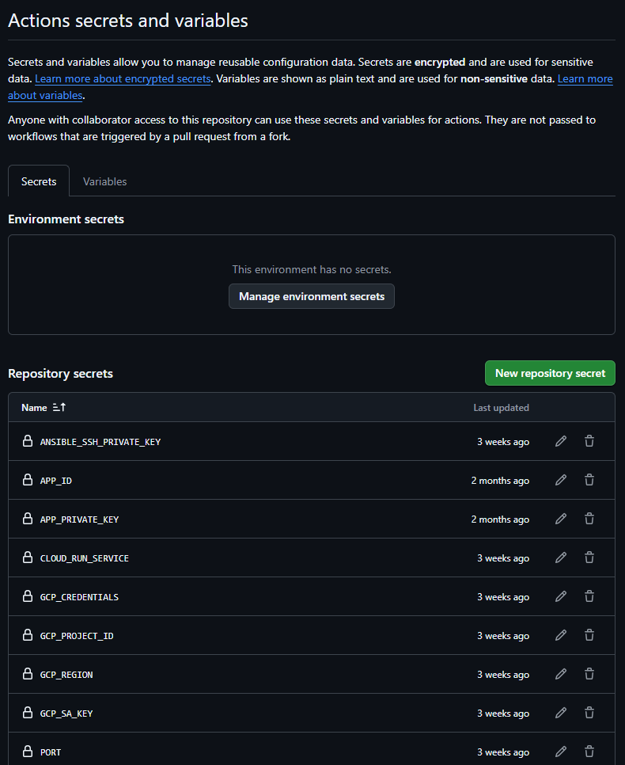
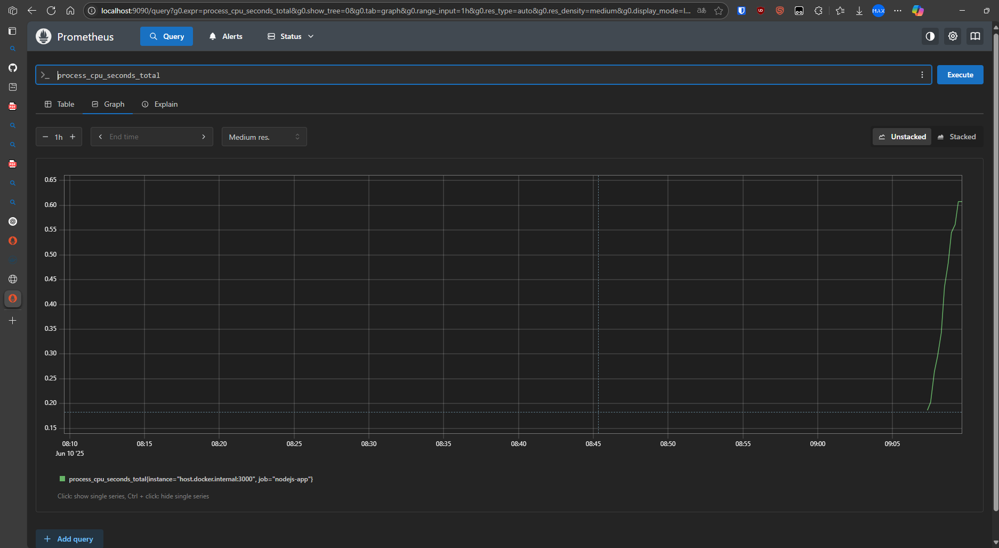
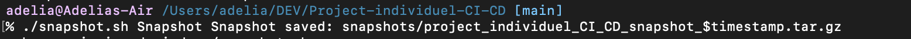
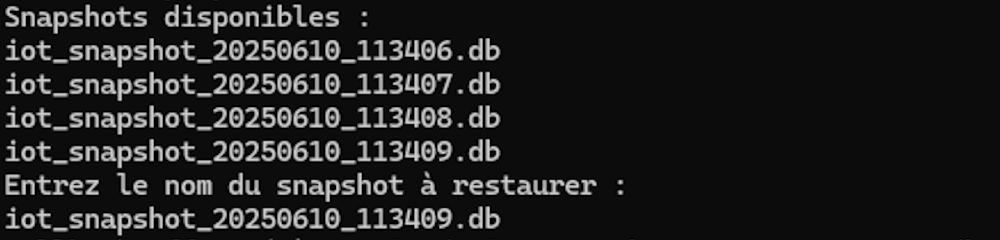

# 🚀 Projet Individuel CI/CD

## Mission Overview

This project aims to build a robust DevOps pipeline from scratch using GitHub technologies and automation tools. The primary goal is to simulate IoT sensor data transmission with a resilient and fully automated release process.

### ✅ Missions Completed

* ✅ **Infrastructure as Code with Terraform**
  Provisioned the required cloud infrastructure to deploy the application environment reproducibly and securely.

* ✅ **Automated Server Configuration with Ansible**
  Configured server environments (Node.js, Nginx, etc.) using playbooks to guarantee uniform deployments.

* ✅ **CI/CD Pipeline with GitHub Actions**
  Two GitHub workflows were implemented:

  * A **CI pipeline** (`ci.yml`) to run tests and check build status.
  * A **release pipeline** (`release.yml`) to automate semantic versioning, changelog generation, Git tagging, and release publication.

* ✅ **Git Branching Strategy: GitFlow**
  The GitFlow model was adopted with main, dev, and feature branches. The release tag was created on the feature branch `feat/2/envcast`.

* ✅ **Semantic Versioning**
  Used tools like `standard-version` to manage semver-compliant releases. Tags such as `v1.0.0` and `v1.0.1` were generated as part of the release workflow.

* ✅ **Logging and Monitoring**
  Integrated basic console logging and simulated monitoring with timestamps to track sensor status in real time.

* ✅ **Snapshot-based Backups**
  Snapshots of the state (JSON file storing the latest sensor readings) are created during CI to back up application state in case of failure.

* ✅ **Rollback Strategy**
  Designed a functional rollback mechanism to revert to the previous snapshot in case the system behaves incorrectly after deployment.

---

## 🧪 `Project-individuel-CI-CD` Setup

1. Open a terminal in the `Project-individuel-CI-CD` directory.
2. Install dependencies:

   ```bash
   npm install
   ```
3. Start the API:

   ```bash
   npm start
   ```
4. The API is accessible at:
   `http://0.0.0.0:8000` (or your local IP)

---

## 📁 Directory Tree (Simplified)

```
├── CHANGELOG.md
├── Dockerfile
├── README.md
├── RELEASE_REPORT.md
├── ansible
│   ├── deploy.yml
│   ├── deploy_no_conteneur.yml
│   └── inventory.ini
├── api
│   ├── app.js
│   ├── bin
│   │   └── www
│   ├── public
│   │   └── stylesheets
│   │       └── style.css
│   ├── routes
│   │   └── infos.js
│   ├── tests
│   │   └── infos.test.js
│   ├── utils
│   │   ├── db.js
│   │   └── swaggerComponents.js
│   └── views
│       ├── error.pug
│       ├── index.pug
│       └── layout.pug
├── eslint.config.js
├── images
│   ├── branche.png
│   ├── commit.png
│   ├── pipeline1.png
│   ├── pipeline2.png
│   ├── pipeline3.png
│   ├── prometheus.png
│   ├── releases.png
│   ├── rollback.png
│   ├── secrets.png
│   ├── snapshot.png
│   └── tags.png
├── infra
│   ├── main.tf
│   ├── outputs.tf
│   ├── terraform.tfstate
│   ├── terraform.tfvars
│   └── variables.tf
├── package-lock.json
├── package.json
├── rapport.md
├── release.sh
├── rollback.sh
└── snapshot.sh
```

---

## 📄 Other Deliverables

* `release.sh` – Automates the version bump, changelog, tagging, and release
* `CHANGELOG.md` – Auto-generated history of changes
* `.github/workflows/release.yml` – GitHub Actions release workflow
* `RELEASE_REPORT.md` – Contains tool comparison and strategic choices
* `snapshot.json` – JSON backup of simulated sensor states
* `rollback.js` – Code to restore state from snapshot

---

## 🔀 Branches Used

* `main`: production-ready version.
* `dev`: continuous integration branch.
* `feat/*`: development of new features.
* `release/*`: pre-production stabilisation.
* `fix/*`: urgent fixes in production.

## 🧾 Branch & Commit History


*Legend: View of `main`, `dev`, and `feat/*` branches*


*Legend: Clear commit messages and tagged versions*

---

## ⚙️ C. CI/CD Pipeline

### 📂 YAML Workflow Files

* [`ci.yml`](.github/workflows/ci.yml): Runs lint, tests, and build checks
* [`deploy.yml`](.github/workflows/deploy.yml): Staging & production deployment via Ansible
* [`release.yml`](.github/workflows/release.yml): Handles versioning, tagging, and GitHub releases

### 🚀 Pipeline Stages

1. **Lint**: Code quality checks (Python – `flake8`)
2. **Tests**: Execution of unit tests (`pytest`)
3. **Build**: Generation of the Flask app package
4. **Packaging**: Creates a versioned tarball
5. **Staging Deployment**: Automatic deployment to test server via Ansible
6. **Production Deployment**: Triggered manually via GitHub Actions
7. **Snapshot**: Saves application state after deployment
8. **Rollback**: Restores previous working state if needed

### 📸 Pipeline Execution


*Legend: GitHub Actions pipeline overview*


*Legend: Infrastructure setup with GCP via Terraform*


*Legend: API deployment step via Ansible*

---

## 📦 D. Packaging & Versioning

### 🔢 Semantic Versioning

We use **Semantic Versioning** with `standard-version`:

* Format: `MAJOR.MINOR.PATCH` (e.g. `2.42.0`)

### 🏷️ Git Tags & Releases

* Tags created via GitHub Actions:
  `git tag -a vX.Y.Z -m "Release X.Y.Z"`
  

* Artifacts and changelogs are available on GitHub Releases
  

---

## 🔐 E. Secrets & Environment Management

### 🔒 Secrets Handling

* Stored securely in **GitHub Secrets**
* Accessed in workflows via `${{ secrets.MY_SECRET }}`
  

### ✅ Best Practices

* No secrets in source code
* `.env` is ignored via `.gitignore`
* Sensitive workflows have restricted access

---

## 🧪 F. Tests & Logs

### 📘 Example of Annotated Logs

Logs and errors are visible during the pipeline:

```bash
✔ Lint passed (flake8)
✔ Tests OK (Coverage: 95%)
✔ Flask build succeeded
✔ Staging deployment: OK
✖ Production deployment: Ansible error (permission denied)
```

*Legend: Clear logs, with quick identification and fixes*


---

## 🖼️ G. Required Screenshots

| Screenshot                                | Description                            |
| ----------------------------------------- | -------------------------------------- |
|          | Full CI/CD pipeline run                |
|        | Git branches overview                  |
|          | Commit history on `main` and `develop` |
|                | Git tag used for release               |
|  | Monitoring logs during pipeline        |
|           | Snapshot creation after deployment     |
|           | Successful rollback after error        |

---

## 📚 H. Documented Procedures

### 🚀 Deployment Procedure

```bash
# From develop, after all tests
git checkout release/vX.Y.Z
git merge develop
git tag -a vX.Y.Z -m "Release X.Y.Z"
git push origin --tags
# GitHub automatically triggers the release pipeline
```

### 🧭 Versioning Plan

* One version per sprint
* Git tag for each validated release
* Release history stored on GitHub Releases


